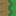
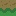
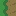
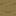
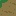
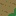

# Grid reference

## Render

### Direction

When asking for a new line on the grid, the values tell what side of the grid the new line is to be rendered.

Render direction table:

Direction|||
:-|-:|-:
Up|0|0
Right|0|1
Down|1|1
Left|1|0

## Tile

The order in wich the tiles transition between different material. Side arrangement must line up to create a transition between two tiles.

### Reference

Lineup

||Name
:-:|:-:
|0x00 
|0x01 
|0x02 
|0x03 
|0x04 
|0x05 
|0x06 
|0x07 
|0x08 
|0x09 
|0x0A 
|0x0B 
|0x0C 
|0x0D 
|0xFF

### Arrangement

Tile|Up|Right|Down|Left
:-:|:-:|:-:|:-:|:-:
 0x00| 0x00  0x05  0x06  0x07| 0x00  0x01  0x07  0x08| 0x00  0x01  0x02  0x03| 0x00  0x03  0x04  0x05 
 0x01| 0x00  0x05  0x06  0x07| 0x02  0x03  0x0A| 0x07  0x08  0x0A| 0x00  0x03  0x04  0x05 
 0x02| 0x00  0x05  0x06  0x07| 0x02  0x03  0x0A| 0x06  0x09  0x0C  0x0D| 0x01  0x02  0x0B 
 0x03| 0x00  0x05  0x06  0x07| 0x00  0x01  0x07  0x08| 0x04  0x05  0x0B| 0x01  0x02  0x0B 
 0x04| 0x03  0x04  0x0C| 0x00  0x01  0x07  0x08| 0x04  0x05  0x0B| 0x08  0x09  0x0A  0x0D 
 0x05| 0x03  0x04  0x0C| 0x00  0x01  0x07  0x08| 0x00  0x01  0x02  0x03| 0x06  0x07  0x0C 
 0x06| 0x02  0x09  0x0A  0x0B| 0x05  0x06  0x0D| 0x00  0x01  0x02  0x03| 0x06  0x07  0x0C 
 0x07| 0x01  0x08  0x0D| 0x05  0x06  0x0D| 0x00  0x01  0x02  0x03| 0x00  0x03  0x04  0x05 
 0x08| 0x01  0x08  0x0D| 0x04  0x09  0x0B  0x0C| 0x07  0x08  0x0A| 0x00  0x03  0x04  0x05 
 0x09| 0x02  0x09  0x0A  0x0B| 0x04  0x09  0x0B  0x0C| 0x06  0x09  0x0C  0x0D| 0x08  0x09  0x0A  0x0D 
 0x0A| 0x01  0x08  0x0D| 0x04  0x09  0x0B  0x0C| 0x06  0x09  0x0C  0x0D| 0x01  0x02  0x0B 
 0x0B| 0x03  0x04  0x0C| 0x02  0x03  0x0A| 0x06  0x09  0x0C  0x0D| 0x08  0x09  0x0A  0x0D 
 0x0C| 0x02  0x09  0x0A  0x0B| 0x05  0x06  0x0D| 0x04  0x05  0x0B| 0x08  0x09  0x0A  0x0D 
 0x0D| 0x02  0x09  0x0A  0x0B| 0x04  0x09  0x0B  0x0C| 0x07  0x08  0x0A| 0x06  0x07  0x0C 

## Row

Example of a row with 10 tiles:

||||||||||||
:-|:-:|:-:|:-:|:-:|:-:|:-:|:-:|:-:|:-:|:-:
Offset|0|1|2|3|4|5|6|7|8|9
Tile|0x00|0x07|0x06|0x0D|0x04|0x00|0x08|0x0B|0x02|0x03
Image||||||||||

✔️❌
